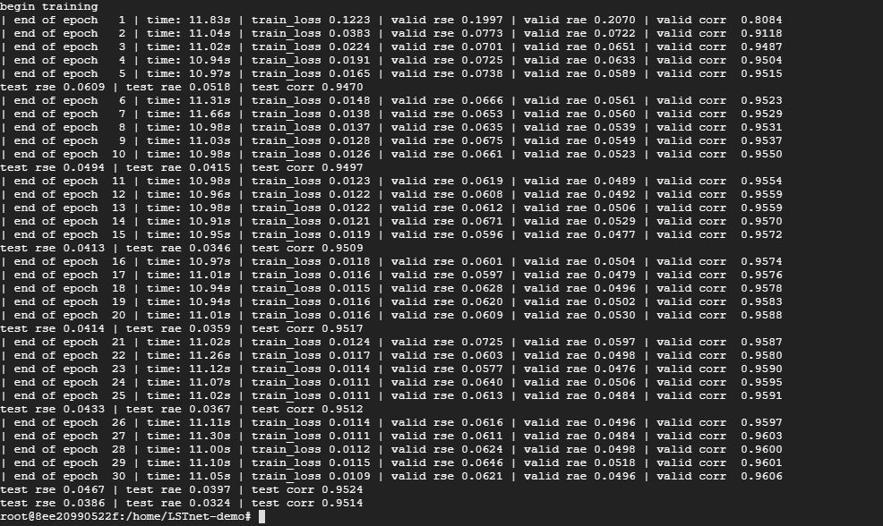

# Time Series Forecasting (Modified for higher Pytorch version & other various fixes)
## Original Repository : https://github.com/laiguokun/LSTNet
## Original Readme
### paper

Modeling Long- and Short-Term Temporal Patterns with Deep Neural Networks.(https://arxiv.org/abs/1703.07015)

### usage

You can download the datasets mentioned in the paper at https://github.com/laiguokun/multivariate-time-series-data.

We give the examples to run different datasets in ele.sh, traffic.sh, solar.sh and stoke.sh.

### Environment 

Python 2.7 and Pytorch 0.3.0

## Docker Container Very Guided Guide for plebs
```
CPU VERSION

docker pull ufoym/deepo:all-py27-cpu
docker run -it ufoym/deepo:all-py27-cpu
or with vilume mounting : 
docker run -it -v Q:\git\LSTnet-demo\:/home/ ufoym/deepo:all-py27-cpu
cd /home/
git clone https://github.com/sw6-aau/LSTnet-demo.git
cd LSTnet-demo
mkdir log/ save/ data/
wget -O data/exchange_rate.txt https://sembrik.s3.eu-west-2.amazonaws.com/sw6/exchange_rate.txt
chmod +x stock-cpu.sh 
./stock-cpu.sh

GPU VERSION

docker pull ufoym/deepo:all-py27-cu90
docker run -it ufoym/deepo:all-py27-cu90
cd /home/
git clone https://github.com/sw6-aau/LSTnet-demo.git
cd LSTnet-demo
mkdir log/ save/ data/
wget -O data/exchange_rate.txt https://sembrik.s3.eu-west-2.amazonaws.com/sw6/exchange_rate.txt
chmod +x stock-gpu.sh 
./stock-gpu.sh
```
## Example on output from training

